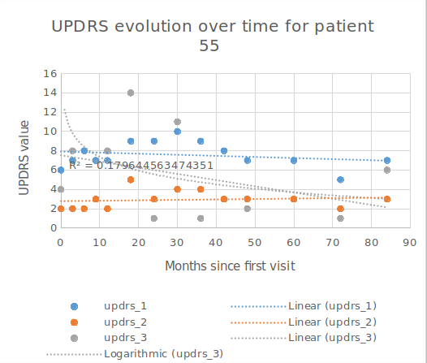

# Introduction

Our project involves competing in a Kaggle competition about Parkinson disease evolution. As a competing group in this competition, our primary objective is to predict MDS-UPDR scores that measure the progression of Parkinson's disease in patients. To achieve this, we will work together to develop a machine learning model trained on data containing protein and peptide levels in subjects with Parkinson's disease and normal age-matched control subjects.

# Data

The competition data consists of three files:
- train_peptides.csv: Contains mass spectrometry data at the peptide level, including visit ID, visit month, patient ID, UniProt ID, peptide sequence, and peptide abundance.
- train_proteins.csv: Provides aggregated protein expression frequencies, with details such as visit ID, visit month, patient ID, UniProt ID, and normalized protein expression (NPX).
- train_clinical_data.csv: Includes clinical data like visit ID, visit month, patient ID, UPDRS scores for different parts (1-4), and information on whether the patient was on medication during the UPDRS assessment.
  
# Work schedule:

Week 1 (March 20-26):
    • Assemble the team and assign roles
    • Review competition guidelines and data
    • Conduct initial data exploration and analysis

Week 2 (March 27 – April 2):
    • Clean and preprocess the data
    • Perform feature engineering and selection
    • Begin developing baseline machine learning models

Week 3 (April 2-9):
    • Continue experimenting with various algorithms and techniques
    • Evaluate and optimize the models

Week 4 (April 10-16):
    • Finalize the chosen model
    • Interpret and analyze the results
    • Prepare a detailed report and presentation of findings
    • Present the report to the class

Week 5 (April 17-23):
    • Review the report as a team
    • Address any final concerns or improvements
    • Submit the final model, to the competition

# Current progress

These last two weeks, we have downloaded the data and made an initial analysis. We have discovered that the values of UPDRs scores have a lot of variability, as we can see in the "Figure 1" example.

{ width=400px}

Our plan is to perform linear regression for the UPDRs values of each patient, and then use the protein data to predict the intercept and slope of this regression.

The first step we took was performing and exploratory data analysis.

## Exploratory data analysis

The EDA was composed of the following steps:

- Check the training datasets: We firstly took a look to every train dataset. This way we can figured out how the data was stored and the dtypes of the features. We discovered that the data in train_proteins and train_peptides datasets were stored in a long format style.

- Modify the tables styles: In order to change from long to wide style, we pivot the train_proteins and train_peptides tables. After this step we obtained two tables with every peptide and protein as a feature.

- Merge: After obtaining the pivot tables, we merged them to the train_clinical data frame. We used a left join so we would not miss any data from the train_clinical dataset.

- Fill missing data: Once we had all the data in one data frame, we had to deal with the missing data. Due to we are working with time series, we thought that the best idea would be to use a linear regression model in order to fill the na values.

- Scale the data: Finally, we had the final train data frame with all the data. Now we scaled the data so it would be easier and quicker to create a model. We use an standard scaler function from sklearn to perform this step.

## Model proposal

After reviewing all the data and understanding every feature, we strongly believe that the best option for this project is to use a linear regression model for predicting the proteins and peptides levels of the next visits and then, use this predicted data to forecast the updr levels with another regression model. We will try different models and compare the results before selecting the final one. The models that we will create will be: neural network, random forest, support vector machine and decision tree.

# Remained work

In the following two weeks we will create the different models and measure their scores in order to select the best one. For doing this, we will also have to select a metric. Finally we will have to use the API provided by kaggle in order to obtain the results in the desired format.